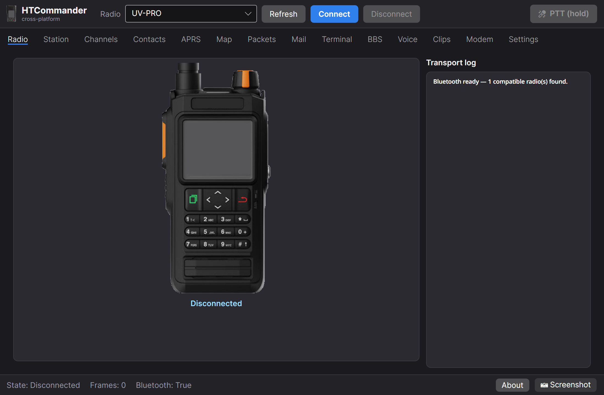

# 📻 Handi-Talky Commander — Linux & macOS

> Native **Linux** and **macOS** builds of Handi-Talky Commander: control your Benshi / BTech
> UV-Pro handheld radio over Bluetooth — live voice, APRS + map, packet, a **drag-and-drop
> channel builder**, Winlink mail, and a BBS — without needing Windows.
>
> It's a cross-platform port (Avalonia / .NET 9) of
> [Ylian Saint-Hilaire's HTCommander](https://github.com/Ylianst/HTCommander). All credit
> for the original application goes to Ylian; this fork rehouses the same core to run
> natively on Linux and macOS. Licensed under **Apache 2.0**, same as upstream.

<p align="center">
  
</p>

## ⬇ Download

### Linux (x86-64)

**[HTCommander-x86_64.AppImage](https://github.com/mprattmd/HTCommander/releases/latest/download/HTCommander-x86_64.AppImage)** — a single self-contained file (bundles the .NET runtime, PortAudio, SQLite, Skia). No install:

```bash
chmod +x HTCommander-x86_64.AppImage
./HTCommander-x86_64.AppImage
```

### macOS (Apple Silicon)

**[HTCommander-macos-arm64.zip](https://github.com/mprattmd/HTCommander/releases/download/v0.4.3/HTCommander-macos-arm64.zip)** — a self-contained `HTCommander.app` (bundles the .NET runtime, the IOBluetooth bridge, PortAudio, SQLite, Skia). Unzip, then:

```bash
# It's not notarized yet, so macOS quarantines downloaded apps. First launch:
xattr -dr com.apple.quarantine HTCommander.app   # or: right-click the app → Open
open HTCommander.app
```

> Apple Silicon (M-series) only for now. Pair the radio in **System Settings → Bluetooth**
> first. macOS will prompt for **Bluetooth** (and **Microphone**, for voice PTT) permission.

### 🔊 PortAudio (audio library)

Both packages **bundle PortAudio**, so audio/voice works out of the box. If audio is
unavailable on macOS, install the system library with **`brew install portaudio`**.
**Building from source** needs PortAudio present: `brew install portaudio` on macOS, or
install `portaudio` / `libportaudio2` from your Linux distro's package manager.

📖 **Install & usage guide: [README-CrossPlatform.md](README-CrossPlatform.md)** · all [releases](https://github.com/mprattmd/HTCommander/releases)

> 📡 **An amateur radio license is required to transmit.** Transmit is always a
> deliberate, press-and-hold action, gated on your configured callsign and an
> **Allow-Transmit** switch. No license? [Start here](https://www.arrl.org/getting-licensed).

### Supported radios

Benshi-protocol radios, connected over **Bluetooth**:

- BTech UV-Pro, UV-50Pro
- Radioddity GA-5WB, DB50-B Mini
- Vero VR-N75 / VR-N76 / VR-N7500 / VR-N7600

---

## What works today

The Linux app today (tracked in [docs/PARITY.md](docs/PARITY.md)). Items marked
**(needs RF)** / **(needs CMS)** / **(needs peer)** are implemented and offline-tested
but await on-air / server / station verification:

> ⚠️ **Packet on the Benshi UV-PRO:** the radio's **"Digital mode" must be OFF** to use
> the app/TNC (KISS) path — that's Winlink, BBS, and the App-TNC APRS beacon. Digital mode
> is only for the radio's **built-in** beacon and disables the TNC; the two are mutually
> exclusive.

- **Bluetooth connect** (BlueZ, raw RFCOMM/SDP) — verified on UV-PRO.
- **Radio status** — battery, channel, RSSI, region, GPS-lock telemetry.
- **Live voice RX/TX** over Bluetooth audio (SBC) with **press-and-hold PTT**, mic
  gain/AGC and speaker volume. Transmit is gated on your callsign + Allow-Transmit.
- **APRS** — receive + decode + station list; **send messages** with a global
  **routes** manager and a destination picker; a **per-packet decode detail** view;
  a **"create APRS channel"** helper; and a **fixed/manual position** (beacon without GPS).
- **APRS beaconing — one selector, two methods** (mutually exclusive):
  - **Radio's built-in beacon** — writes the Beacon/Ident (BSS) settings and points the
    radio's own beacon at your **APRS channel** (`auto_share_loc_ch`), so it beacons there
    regardless of the tuned channel. **Needs "Digital mode" ON** on the radio.
  - **App beacon via the TNC** — *Beacon now* / *Auto-beacon* builds a position report and
    sends it on your APRS channel through the radio's hardware TNC (uses your fixed/GPS
    position + symbol + comment). **Needs "Digital mode" OFF** on the radio.
- **Map** (OpenStreetMap) — station markers, **per-callsign track polylines**, a
  last-N-minutes **time filter**, large/small marker toggle, a **radio + serial GPS
  marker**, and **center-to-GPS**.
- **GPS** — radio position details (lat/lon/alt/speed/heading) + **request fresh
  position**; **serial NMEA GPS source** config (port/baud) that also pushes position
  to the radio *(a live fix needs GPS hardware on the air)*.
- **Terminal** — connectionless UI-frame send **and connected-mode AX.25 sessions**
  (connect panel: protocol / station / channel) *(a session needs a peer)*.
- **Packet capture** — live list, decode detail, **CSV export** and **load capture**.
- **Channel builder** — **click a memory tile to edit it** (name, RX/TX, CTCSS, mode,
  power, scan → write that one channel), plus drag-and-drop slot programming, CSV import
  (CHIRP / RepeaterBook / native), CSV export, bank selector, load-all-banks, and
  write-to-radio.
- **Contacts** / address book with connection setup (channel / path / AX.25 dest / auth).
- **Winlink mail** — local SQLite store, six folders with unread counts, compose with
  **CC + attachments**, **reply / reply-all / forward**, **save as draft**, **move
  between folders**, **backup / restore**, and a session/traffic log. Sync over the
  **internet** *(needs a reachable CMS)* or **over the radio** to a Winlink station
  *(needs an RMS gateway)*.
- **BBS host** — connected-mode AX.25 mail drop on the current channel *(needs a
  station to connect over the air)*.
- **DSP / audio extras** — a scrolling **FFT waterfall** of the RX audio (Modem tab),
  a **soft-modem** (AFSK1200 / PSK / G3RUH) fed the RX audio with decoded frames routed
  to Packets *(demod needs RF to verify)*, **WAV record/playback**, an **audio clips**
  recorder, and **Morse / DTMF** generate + local preview.
- **Station identity & settings** — callsign, Station ID, Allow-Transmit, Winlink
  password, plus audio devices / mic gain / volume.
- **AppImage packaging** + GitHub releases.

## Install

### Option A — AppImage (recommended, no install)

A single self-contained file — it bundles the .NET runtime and native libraries
(PortAudio, SQLite, Skia). Nothing to install.

```bash
# Download the latest from the Releases page, then:
chmod +x HTCommander-x86_64.AppImage
./HTCommander-x86_64.AppImage
```

To integrate it into your app menu, drop it in `~/Applications` (or use a tool like
Gear Lever / AppImageLauncher).

### Option B — self-contained folder

```bash
dotnet publish cross/HTCommander.UI.Avalonia/HTCommander.UI.Avalonia.csproj \
  -c Release -r linux-x64 --self-contained true -o out/
./out/HTCommander.UI.Avalonia
```

### Prerequisites

- **Bluetooth** with BlueZ (standard on modern Linux). Pair the radio in your desktop's
  Bluetooth settings **first**, then launch HTCommander.
- **Audio**: PipeWire, PulseAudio, or ALSA (PipeWire on Fedora 40+ works well).
- Nothing else for the AppImage; the self-contained folder also needs no system .NET.

## Getting started

1. **Pair** the radio once in your OS Bluetooth settings (power it on, make it
   discoverable, pair). You only do this once.
2. Launch HTCommander, pick your radio in the **Radio** dropdown (top bar), and click
   **Connect**. The radio panel shows battery + live status; the log shows BlueZ/GAIA traffic.
3. Open the **Station** tab and set your **callsign**, **Station ID**, and (to transmit)
   flip **Allow-Transmit** on. For Winlink, set your **Winlink password** here too.
4. If you'll do APRS/Winlink/BBS, hit **Channels → Load all banks** so every memory
   channel is known, and pick your **APRS channel** in the APRS setup.

> If connecting fails with a key/bonding error, remove the pairing in your OS and
> re-pair — a stale bond is the usual cause. If it can't find the radio's data channel,
> toggle the radio's Bluetooth off/on.

## Using the app — tab by tab

- **Radio** — live status (battery, channel, RSSI, region, GPS) + raw transport log.
- **Station** — identity (callsign / Station ID / Winlink password), **Allow-Transmit**,
  the **APRS channel** picker, and the **beacon method** selector (Off / Radio built-in /
  App-TNC) with on-screen guidance on what each needs.
- **Channels** — **click a memory tile to edit that channel** (name, RX/TX, CTCSS, mode,
  power, scan → write it). Also: drag-and-drop programming, **Import/Export CSV**
  (CHIRP / RepeaterBook / native), **Load all banks**, and **⬆ Write to radio**.
- **Contacts** — APRS/Winlink/terminal address book; this is where a contact's **channel**
  and AX.25/connection settings live (incl. the Winlink RMS station to sync with).
- **APRS** — send/receive messages with a routes manager + destination picker; a fixed
  or GPS position; and the beacon controls.
- **Map** — OpenStreetMap with station markers, per-callsign tracks, time filter, radio +
  serial GPS markers, and **aprs.fi** internet lookups (paste a free key in Settings).
- **Mail** — Winlink mailboxes; compose → Outbox → **Sync (internet)** or **Sync (radio)**
  to an RMS gateway. Stored at `~/.config/HTCommander/mail.db`.
- **Terminal / Packets / BBS** — connectionless + connected-mode AX.25, a live frame
  list with decode detail, and a connected-mode BBS host.
- **Voice / Modem / Clips** — PTT voice, the FFT waterfall + soft-modem, and WAV/clip tools.
- **Settings** — audio devices, mic gain, output volume, GPS serial source, and the
  **aprs.fi API key**.

> ⚠️ **Packet (Winlink / BBS / App-TNC beacon) needs the radio's "Digital mode" OFF.**
> Digital mode is only for the radio's built-in beacon and disables the TNC.

## Transmitting & safety

Transmitting is **operator-initiated and fail-safe**:

- **Transmit is gated** on a configured **callsign** + the **Allow-Transmit** switch
  (Station tab). With either unset, the app will not key the radio — and `SendPacket`
  enforces this too.
- **PTT is press-and-hold** — the radio keys only while you hold, and un-keys the moment
  you release or the pointer leaves the button. The app never transmits on its own.
- You are responsible for a frequency, power, and mode permitted by your license. When
  testing, a dummy load and low power are good practice.
- **Writing channels** reconfigures the radio's memory — a deliberate, connection-gated action.

## Build from source

Requires the **.NET 9 SDK**.

```bash
# Build everything (Core + Linux platform + Avalonia UI)
dotnet build HTCommander.CrossPlatform.sln

# Run the app
dotnet run --project cross/HTCommander.UI.Avalonia/HTCommander.UI.Avalonia.csproj

# Build a single-file AppImage (needs appimagetool + FUSE on PATH; without them you
# still get a runnable packaging/AppDir/AppRun)
./packaging/build-appimage.sh
```

The full install/usage/architecture guide is in
[README-CrossPlatform.md](README-CrossPlatform.md).

## Coming next

See [docs/ROADMAP.md](docs/ROADMAP.md). Phases 0–4 (identity, APRS, mail, terminal,
GPS/map) are in the app; the next work is on-air verification of the **(needs RF/CMS/peer)**
items above and the longer-haul features below.

> **Partially done** (usable, with caveats): **Morse / DTMF** generate + local preview
> (on-air tone TX pending), **soft-modem** decode (AFSK1200/PSK/G3RUH — wired, demod
> unverified on RF), and **audio clips** (record/name/play/delete; transmit-clip pending).
>
> **Not yet ported / planned later:** text-to-speech and speech-to-text, SSTV
> send/receive, AGWPE server, YAPP & torrent file transfer, web server, ADS-B / dump1090,
> self-update, detached tabs, and a macOS build. These exist in the original Windows app
> but are **not available** in the Linux build today.

---

### Demonstration video (original Windows app)

[](https://www.youtube.com/watch?v=JJ6E7fRQD7o)

### Credits

Original application by **Ylian Saint-Hilaire** — [github.com/Ylianst/HTCommander](https://github.com/Ylianst/HTCommander).

This tool is based on the decoding work done by Kyle Husmann, KC3SLD and the [BenLink](https://github.com/khusmann/benlink) project, which decoded the Bluetooth commands for these radios. Also [APRS-Parser](https://github.com/k0qed/aprs-parser) by Lee, K0QED.

Map data provided by [openstreetmap.org](https://openstreetmap.org), the project that creates and distributes free geographic data for the world.
