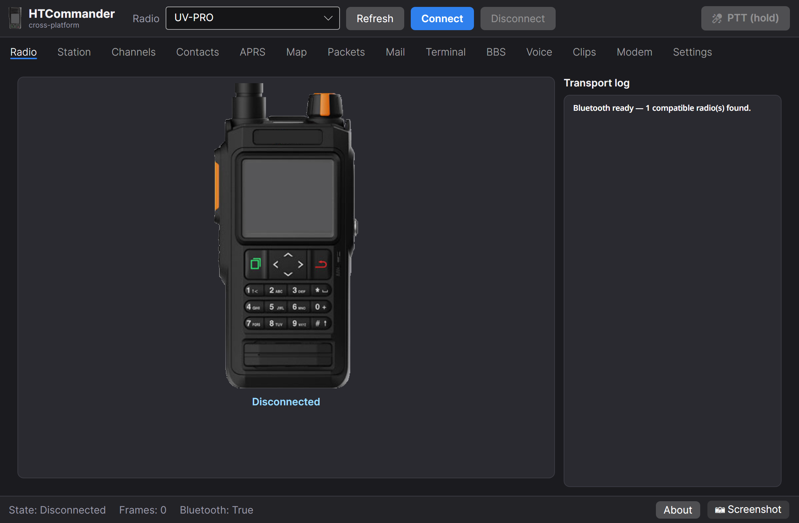

# 📻 Handi-Talky Commander — Linux, macOS, Android & iOS

> Native **Linux**, **macOS**, **Android**, and **iOS** builds of Handi-Talky Commander:
> control your Benshi / BTech UV-Pro handheld radio over Bluetooth — live voice (desktop),
> APRS + map, packet, a **drag-and-drop channel builder** with **RepeaterBook search**,
> Winlink mail, and a BBS — without needing Windows.
>
> It's a cross-platform port (Avalonia / .NET 9) of
> [Ylian Saint-Hilaire's HTCommander](https://github.com/Ylianst/HTCommander). All credit
> for the original application goes to Ylian; this fork rehouses the same core to run
> natively on Linux and macOS. Licensed under **Apache 2.0**, same as upstream.

<p align="center">
  
</p>

> **Latest release: v0.6.2.** The download links below always fetch the newest build —
> see the [releases page](https://github.com/mprattmd/HTCommander/releases) for the full
> changelog. Setup walkthrough (station → transmit → APRS → Winlink) is in
> **[Getting started](#-getting-started)** below.

## ⬇ Download

### Linux (x86-64)

**[HTCommander-x86_64.AppImage](https://github.com/mprattmd/HTCommander/releases/latest/download/HTCommander-x86_64.AppImage)** — a single self-contained file (bundles the .NET runtime, PortAudio, SQLite, Skia). No install:

```bash
chmod +x HTCommander-x86_64.AppImage
./HTCommander-x86_64.AppImage
```

### macOS

A self-contained `HTCommander.app` (bundles the .NET runtime, the IOBluetooth bridge,
PortAudio, SQLite, Skia). The app is **signed with a Developer ID and notarized by Apple**,
so it just opens — no quarantine workaround needed.

- **Apple Silicon (M-series):** **[HTCommander-macos-arm64.zip](https://github.com/mprattmd/HTCommander/releases/latest/download/HTCommander-macos-arm64.zip)**
- **Intel:** **[HTCommander-macos-x64.zip](https://github.com/mprattmd/HTCommander/releases/latest/download/HTCommander-macos-x64.zip)**

Unzip, then:

```bash
open HTCommander.app
```

> macOS 11+. If you're unsure which build you need, click  → **About This Mac**:
> *Apple M…* → arm64, *Intel* → x64. Pair the radio in **System Settings → Bluetooth**
> first. macOS will prompt for **Bluetooth** (and **Microphone**, for voice PTT) permission.

### Android (phone, data-only beta)

**[HTCommander-android.apk](https://github.com/mprattmd/HTCommander/releases/latest/download/HTCommander-android.apk)** — a phone-first build (bottom-nav UI: Radio · Channels · APRS · Mail · Map). Pair the radio in **Settings → Bluetooth** first, then sideload the APK (enable "Install unknown apps" for your browser/file manager) and allow the **Nearby devices** permission on launch.

> Round-one Android scope is **data only** (APRS, packet, Winlink mail, channels) — no voice/PTT yet.

### iOS / iPadOS (data-only beta — TestFlight)

A BLE build for iPhone & iPad. The radio speaks the **same protocol over Bluetooth LE** as
it does over Classic Bluetooth, and iOS *does* allow third-party apps to use BLE — so, unlike
Classic Bluetooth, **no MFi certification is needed.** (Join the beta via TestFlight; link on
the [releases page](https://github.com/mprattmd/HTCommander/releases).)

> ⚠️ **Connect through the app — NOT iOS Settings → Bluetooth.**
> In **Settings → Bluetooth**, the radio appears as a *Classic* device and iOS shows
> **"\<radio\> is not supported"**. That message is **expected and harmless** — iOS blocks
> non-MFi *Classic* Bluetooth, and HTCommander doesn't use that path. **Do not pair the radio
> there.** Instead:
>
> 1. Open **HTCommander** and tap **Allow** on the Bluetooth permission prompt (first launch).
> 2. Power on the radio, go to the **Radio** tab, tap **Refresh**, then **Connect** — the app
>    finds the radio over **BLE** on its own.
> 3. If you already tapped the radio in Settings → Bluetooth, choose **Forget This Device**
>    (it never connects there, and it does not affect the app).

> iOS scope matches Android: **data only** (APRS, packet, Winlink mail, channels) — no
> voice/PTT, since iOS has no access to the radio's Classic-Bluetooth audio channel.

### 🔊 PortAudio (audio library)

Both packages **bundle PortAudio**, so audio/voice works out of the box. If audio is
unavailable on macOS, install the system library with **`brew install portaudio`**.
**Building from source** needs PortAudio present: `brew install portaudio` on macOS, or
install `portaudio` / `libportaudio2` from your Linux distro's package manager.

📖 **Install & usage guide: [README-CrossPlatform.md](README-CrossPlatform.md)** · all [releases](https://github.com/mprattmd/HTCommander/releases)

> 📡 **An amateur radio license is required to transmit.** Transmit is always a
> deliberate, press-and-hold action, gated on your configured callsign and an
> **Allow-Transmit** switch. No license? [Start here](https://www.arrl.org/getting-licensed).

### Supported radios

Benshi-protocol radios, connected over **Bluetooth**:

- BTech UV-Pro, UV-50Pro
- Radioddity GA-5WB, DB50-B Mini
- Vero VR-N75 / VR-N76 / VR-N7500 / VR-N7600

---

## 🚀 Getting started

Work through these in order — each step builds on the last. Steps 1–3 are required for
any transmit; step 4 adds APRS; step 5 adds Winlink mail over the radio.

### 1. Pair and connect the radio

1. **Pair the radio once in your OS Bluetooth settings** — power it on, make it
   discoverable, and pair. (On **iOS**, *skip* this and connect from inside the app — see
   the iOS note under Download.) You only pair once.
2. Launch HTCommander, choose your radio in the **Radio** dropdown (top bar), and click
   **Connect**. The Radio panel then shows battery, channel, and live status.

> **Connect trouble?** A key/bonding error usually means a stale pairing — remove it in
> your OS Bluetooth settings and pair again. If the app can't find the radio's data
> channel, toggle the radio's Bluetooth off and on.

### 2. Set up your station

Open the **Station** tab and fill in your identity — this is used by voice, APRS,
Winlink, and the BBS:

- **Callsign** — your amateur call (required to transmit).
- **Station ID (SSID)** — the suffix that identifies *this* station (e.g. `-7` for a
  handheld). Optional but recommended.
- **Winlink password** — only if you'll use Winlink mail. Set it once here; every
  Winlink/BBS connection reuses it (there's no per-contact password).

Settings are saved automatically to `~/.config/HTCommander`.

### 3. Enable transmit

Still on the **Station** tab, turn on **Allow transmit**. Transmit stays disabled until
you have **both a callsign and Allow transmit on** — the app will not key the radio
otherwise.

> 📡 **A licence is required to transmit.** Voice PTT is always press-and-hold, and the
> app never keys the radio on its own. See [Transmitting & safety](#transmitting--safety).

### 4. Define your APRS channel

APRS messaging and the app's beacon both transmit on **one** memory channel you
designate — set this up before sending any APRS:

1. If your APRS frequency isn't already a memory channel, go to the **APRS** tab and click
   **Create APRS channel** to add one (commonly 144.390 MHz in North America).
2. On the **Station** tab, pick that channel in the **APRS channel** dropdown. If it lives
   in another memory bank and isn't listed, run **Channels → Load all banks** first so it
   appears.
3. (Optional) Set your **beacon method** on the Station tab:
   - **App (TNC)** — the app sends your position through the radio's data TNC. Works
     alongside Winlink/BBS/APRS messages. **Radio "Digital mode" must be OFF.**
   - **Radio (built-in)** — the radio beacons on its own, but needs **Digital mode ON**,
     which **disables the TNC** (Winlink, BBS, and APRS messages stop). The two are
     mutually exclusive.

You can now send/receive APRS messages from the **APRS** tab and see stations on the **Map**.

> ⚠️ **Packet (Winlink / BBS / app APRS beacon) needs the radio's "Digital mode" OFF.**
> Digital mode is only for the radio's built-in beacon and turns the TNC off.

### 5. Add a Winlink contact (to use Winlink mail)

Winlink-over-radio connects to an **RMS gateway** station. The gateway is stored as a
contact, *not* on the Station tab:

1. Make sure your **Winlink password** is set (step 2).
2. Go to **Contacts → add a contact** and choose type **Winlink**.
3. Fill in:
   - **AX.25 destination** — the gateway's exact call-SSID to connect to over the air,
     e.g. `KE4AXW-10`. *(The Callsign field above is just a label; the connection uses
     this destination.)*
   - **Connect on channel** — the memory channel the gateway operates on. (Leave blank to
     use whatever you're currently tuned to.)
4. On the **Station** tab, choose this contact under **Winlink station for radio sync**.
5. On the **Mail** tab, compose a message into the **Outbox**, then **Sync (radio)** to
   connect to the gateway and exchange mail. (**Sync (internet)** works too if you have a
   reachable CMS — no radio needed.)

Find gateways near you in the [Winlink RMS map](https://www.winlink.org/RMSChannels).
Mail is stored locally at `~/.config/HTCommander/mail.db`.

### 6. (Optional) Program channels from RepeaterBook

The channel builder can search the online [RepeaterBook](https://www.repeaterbook.com)
directory (amateur **and** GMRS) and add repeaters straight to your radio. It needs a free
per-user API token:

1. Sign in to your free [RepeaterBook](https://www.repeaterbook.com) account and request
   an **app token for HTCommander** on the
   [API Apps page](https://www.repeaterbook.com/user/api_apps.php) — it begins with
   **`rbuapp_`**.
2. Paste it into **Settings → RepeaterBook**. It **saves automatically** as you type
   (no Save button — watch for the **✓ Saved** flash), stored encrypted in your OS keychain.
3. On **Channels**, use **🔎 Search RepeaterBook** — search by state / county / city or by
   **proximity to your GPS fix**, tick the repeaters you want, and add them. On the desktop
   you can drag them onto memory slots; on Android, pick a slot (or **Place all in free
   slots**) and each placement writes to the radio. *Data courtesy of RepeaterBook.com.*

## Tab reference

- **Radio** — live status (battery, channel, RSSI, region, GPS) + raw transport log.
- **Station** — identity (callsign / Station ID / Winlink password), **Allow transmit**,
  the **APRS channel** picker, the **Winlink station** picker, and the **beacon method**
  selector with on-screen guidance.
- **Channels** — click a memory tile to edit it (name, RX/TX, CTCSS, mode, power, scan →
  write it), drag-and-drop programming, **Import/Export CSV** (CHIRP / RepeaterBook /
  native), **Load all banks**, **Search RepeaterBook**, and **Write ALL to radio**.
- **Contacts** — APRS/Winlink/terminal address book; where a contact's connect channel and
  AX.25 destination live (including the Winlink RMS gateway).
- **APRS** — send/receive messages with a routes manager + destination picker, a fixed or
  GPS position, **Create APRS channel**, and beacon controls.
- **Map** — OpenStreetMap with station markers, per-callsign tracks, a time filter, radio +
  serial GPS markers, and **aprs.fi** internet lookups (paste a free key in Settings).
- **Mail** — Winlink mailboxes; compose → Outbox → **Sync (internet)** or **Sync (radio)**.
- **Terminal / Packets / BBS** — connectionless + connected-mode AX.25, a live frame list
  with decode detail, and a connected-mode BBS host.
- **Voice / Modem / Clips** — press-and-hold PTT voice, the FFT waterfall + soft-modem, and
  WAV/clip tools.
- **Settings** — audio devices, mic gain, output volume, GPS serial source, the **aprs.fi
  API key**, and the **RepeaterBook API token**.

## Transmitting & safety

Transmitting is **operator-initiated and fail-safe**:

- **Transmit is gated** on a configured **callsign** + the **Allow-Transmit** switch
  (Station tab). With either unset, the app will not key the radio — and `SendPacket`
  enforces this too.
- **PTT is press-and-hold** — the radio keys only while you hold, and un-keys the moment
  you release or the pointer leaves the button. The app never transmits on its own.
- You are responsible for a frequency, power, and mode permitted by your license. When
  testing, a dummy load and low power are good practice.
- **Writing channels** reconfigures the radio's memory — a deliberate, connection-gated action.

## Build from source

Requires the **.NET 9 SDK**.

```bash
# Build everything (Core + Linux platform + Avalonia UI)
dotnet build HTCommander.CrossPlatform.sln

# Run the app
dotnet run --project cross/HTCommander.UI.Avalonia/HTCommander.UI.Avalonia.csproj

# Build a single-file AppImage (needs appimagetool + FUSE on PATH; without them you
# still get a runnable packaging/AppDir/AppRun)
./packaging/build-appimage.sh
```

The full install/usage/architecture guide is in
[README-CrossPlatform.md](README-CrossPlatform.md).

## 🐞 Reporting bugs

Found a problem? **[Open an issue](https://github.com/mprattmd/HTCommander/issues/new/choose)**
— the bug-report form asks for your platform, app version, radio model, and steps. For
Bluetooth problems, run from a terminal with `HTBT_DEBUG=1` and paste the output:

```bash
# macOS
HTBT_DEBUG=1 /Applications/HTCommander.app/Contents/MacOS/HTCommander.UI.Avalonia
# Linux
HTBT_DEBUG=1 ./HTCommander-x86_64.AppImage
```

---

### Demonstration video (original Windows app)

[](https://www.youtube.com/watch?v=JJ6E7fRQD7o)

### Credits

Original application by **Ylian Saint-Hilaire** — [github.com/Ylianst/HTCommander](https://github.com/Ylianst/HTCommander).

This tool is based on the decoding work done by Kyle Husmann, KC3SLD and the [BenLink](https://github.com/khusmann/benlink) project, which decoded the Bluetooth commands for these radios. Also [APRS-Parser](https://github.com/k0qed/aprs-parser) by Lee, K0QED.

Map data provided by [openstreetmap.org](https://openstreetmap.org), the project that creates and distributes free geographic data for the world.
